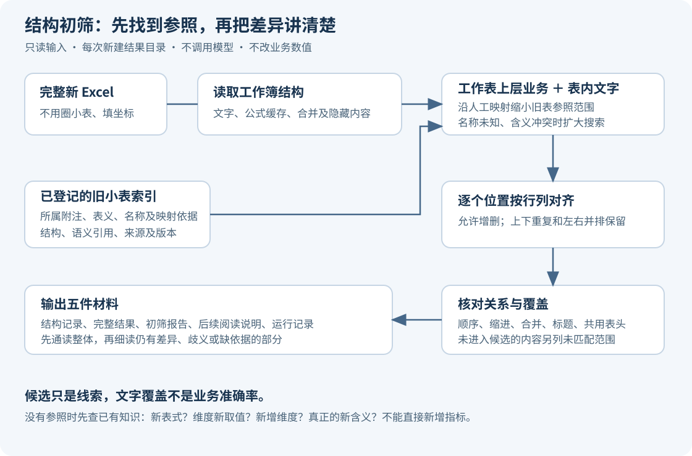
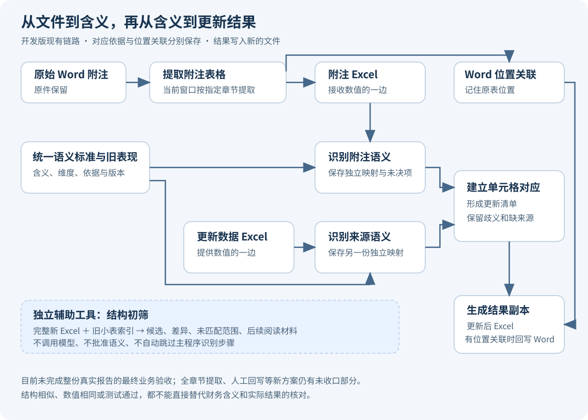

# 📘 附注自动更新系统

**让 Word 附注里的表格、Excel 更新数据和“每个数字究竟代表什么”连起来，减少逐格复制和反复辨认表式的工作。**

例如，两张表都写着“银行存款”，一张是期末余额，一张是本期增加额。名称相同，不代表可以互相取数。本项目希望先把每个财务数据格的含义说明白，再建立对应，最后把给定的数值写到对应位置。

🚧 **当前公开的是开发版源码。结构初筛有独立行为验证；完整附注更新尚未完成整份真实报告的最终业务验收。** 程序测试通过，不等于模型理解全部正确，也不等于已经覆盖所有表格。请先用副本体验。

本项目面向 **Windows**。仓库包含中文窗口程序、Word 表格桥接、语义知识整理工具、结构初筛和测试。采用 **AGPL-3.0 开源协议**，完整文本见 [LICENSE](LICENSE)。

## 🧭 第一次来，按这个顺序看

1. 只想先看看效果：看“先体验结构初筛”。这一条不需要模型账号，不会发起模型请求。
2. 想更新附注：看“主程序怎么用”，先准备自己的 Word 报告和 Excel 更新数据。
3. 想知道软件怎么判断：看“运行逻辑”和两张流程图。
4. 手里已有语义成果或结构索引：看“已有成果怎样复用”。
5. 遇到报错、没有候选、结果不对：看“常见问题”，不要把输出中的“待处理”直接改成“通过”。

## 🎯 这套软件处理什么

| 工作 | 程序提供的帮助 | 结果是什么 |
|---|---|---|
| 从附注中取出表格 | 将 Word 表格提取为 Excel，并保存两者的位置关联 | 可查看和继续处理的表格，以及位置关联文件 |
| 认识每个数据格 | 借助统一语义标准和模型，分别解释附注表格、更新数据表 | 两份各自独立的语义映射 |
| 找出哪些格可以对应 | 对照已保存的含义及实际维度，列出对应和未解决问题 | 更新清单、逐格核对表和需要处理的事项 |
| 写出结果 | 根据已有清单生成新的附注表格，并在具备位置关联时回写 Word | 独立的结果副本 |
| 先找熟悉的表式 | 将完整新 Excel 与已经登记的小表结构比较 | 候选、差异、未匹配范围和后续阅读材料 |
| 保存已有认识 | 整理定义、维度、表现形式、旧新对应及来源依据 | 可继续复用、可以回查来源的知识资料 |

**结构初筛是独立工具。** 它不调用模型、不批准语义、不修改金额、不回写 Word；目前也不会把初筛结果自动导入主程序，直接跳过语义识别。后续接入需要保留语义确认环节。

**主窗口当前仍沿用“财务报表重要项目的说明”章节入口。** 桥接底层有全正文表格能力，但不能据此宣称主窗口已经完成“所有章节表格提取及人工回写”的新方案。历史整理脚本也仍需要指定格式的本地资料。当前边界见 [开源收尾验证](文档/开源收尾验证.md)。

## 🧩 先认识六个词

| 名称 | 用大白话解释 |
|---|---|
| 附注表格 | 从 Word 取出的、准备更新的 Excel 表格。可以理解为“接收数值的一边”。 |
| 更新数据表 | 本轮准备使用的新数据。可以理解为“提供数值的一边”。 |
| 语义金标准 | 统一解释财务数据含义的资料。它规定含义怎样表达；有这个名字并不保证所有记录都已经完美或适合你的业务。 |
| 指标与维度 | 指标是“在说什么”，例如银行存款余额；维度是“具体是哪一种情况”，例如哪个期间、币种或明细对象。新增客户通常是新的取值，不当然是新指标。 |
| 语义映射 | 某个文件中，每个数据格与其业务含义的对应记录。另一份表必须有自己的映射，不能只照搬坐标。 |
| 结构索引 | 旧小表的文字、表头、顺序、合并及来源目录。用来快速找参照，不代替含义判断。 |

“候选”就是值得进一步看的参照；“未匹配”就是本次没有找到可靠结构参照。“覆盖比例”说的是对上多少文字，**不是财务准确率**。

## 🖥️ 准备电脑

需要 Windows、Python 3.14，以及本项目使用的几个表格和文档组件。处理 Word 时，还需要微软 .NET 10 开发工具包。只体验结构初筛，可以暂时不准备 Word 部分。

主程序需要由 Excel 重算复杂公式时，电脑还应安装微软桌面版 Excel。完整离线检查包含实际调用 Excel 的用例，也需要这个条件。单独运行结构初筛和虚构示例不需要安装 Excel；它们读取文件中已保存的内容。

1. 从本页上方绿色的 **Code** 按钮选择 **Download ZIP**，下载压缩包。
2. 在下载的文件上单击右键，选择“全部解压缩”。进入解压后的文件夹，应能看到“启动程序.cmd”和本说明。不要在压缩包预览里直接运行。
3. 从 [Python 官方 Windows 下载页](https://www.python.org/downloads/windows/) 安装 Python 3.14。它是运行程序的基础软件，不需要学习编程。安装时保留桌面窗口组件和安装组件的功能。
4. 双击“准备运行环境.cmd”。它会为选定的本机 Python 安装本项目所需组件，需要联网。等窗口显示准备完成；如果显示失败，先保留错误信息，不要继续假设已装好。
5. 程序会先查找常见的 Python 3.14 安装位置。如果没找到，会弹出文件选择窗口，让你选择安装目录里的 python.exe，不需要手填路径。

想提取或回写 Word，再做两步：

1. 从 [微软 .NET 10 下载页](https://dotnet.microsoft.com/zh-cn/download/dotnet/10.0) 安装“开发工具包”。仅装“运行时”不足以从源码准备 Word 功能。
2. 双击“准备Word功能.cmd”。首次会联网取得所需组件并生成本机使用的 Word 桥接程序。已有桥接程序时，这个入口不会覆盖它。

本仓库没有打包好的安装程序。上述准备工作通常只需做一次；换电脑或重新安装运行环境时，再准备一次。

## 🧪 先体验结构初筛

1. 完成上面的 Python 环境准备。
2. 双击“体验结构初筛.cmd”。
3. 程序会生成一张**完全虚构的货币资金小表**，建立只含这张表的演示索引，再比较一张修改了金额的新表。
4. 等窗口显示“比较完成”。窗口会给出结果目录。
5. 打开该目录中的“初筛材料”，先看“初筛报告.md”，再看“LLM交接说明.md”。后者虽然使用了历史文件名，内容就是交给后续人工智能阅读的说明。

这个例子中，现金、银行存款的金额发生变化，表头和行列文字保持不变。你应看到结构仍然能够对应。**这只证明结构线索还在，不代表软件已经批准新金额或确认会计含义。**

每次体验都会在“结构初筛”下面的“运行结果”中建立新目录。不会覆盖上一次体验，也不会改动你的原始报告。

演示索引只有一张虚构小表。开发时使用的 714 张小表索引不随公开包提供，不能把演示结果称为五种样式的完整查找。

## 📂 用自己的新表做结构初筛

### 第一步：准备参照索引

如果已有本项目建立的索引，找到同时含有“小表记录.jsonl”“文字查找.json”“索引清单.json”的文件夹，保留完整文件夹。

**升级到工作表语义版后，请重建一次索引。** 新索引会保存原人工映射里的“所属附注事项—表的业务含义—原映射记录”，并关联工作表名称和已登记标题。旧索引仍能打开，但缺少这层依据时，程序会明确提示并扩大搜索，不能获得完整的名称筛选效果。重建会另存新目录，保留原索引。

如果需要从既有成果重建，双击“准备初筛索引.cmd”，依次选择：

1. 已整理的统一语义成果文件夹，其中应有“资产清单.json”。
2. 包含“附注样式1.xlsx”至“附注样式5.xlsx”的原样式文件夹。
3. 准备保存新索引的文件夹。

程序会核对登记文件及其指纹，再建立一个新的索引目录。如果缺少旧映射、复核资料或文件被改动，会明确报错。**这里不能只放五张 Excel 就当作已经完成语义登记。** 所需资料及重建限制见 [语义资料与重建索引](文档/语义资料与重建索引.md)。

### 第二步：选择完整新 Excel

打开“结构初筛”文件夹，双击“启动初筛.cmd”。在弹出的窗口里选择要比较的完整 Excel 文件。不用事先圈出某张小表，也不用填写单元格地址。

如果默认索引不存在，程序会再弹出窗口，请你选择已有索引目录。任一选择窗口取消后，本次比较结束，不生成比较成果。

程序默认先查找“结构初筛”下“索引”中的“工作表语义版_正式”，存在时优先使用；没有则沿用“首版”，两者都没有才弹出选择窗口。下载的公开包不含作者本机的正式索引，按窗口选择你自己重建的完整目录即可。

### 第三步：查看五件材料

| 文件 | 先看什么 | 用来做什么 |
|---|---|---|
| 初筛报告.md | 命中了哪些参照、有哪些差异和未匹配范围 | 快速了解本次比较结果 |
| LLM交接说明.md | 必须进一步细读的范围及原因 | 给后续阅读环节安排工作 |
| 初筛结果.json | 每个候选的具体坐标、对应、差异、来源及版本 | 完整回查；通常由程序或维护人员使用 |
| 工作簿结构.json | 新表全部已读取内容、公式、缓存、合并和隐藏信息 | 后续阅读原始结构依据 |
| 运行记录.json | 使用了哪些输入、索引，以及内容覆盖检查结论 | 复现本次运行，核对是否遗漏内容 |

普通使用者先读两份说明即可，不必手改其余文件。报告中的摘要可能只展示前几项，完整明细在结果文件中。

### 第四步：理解“需要细读”

下面这些情况需要继续阅读原表和已有知识：工作表名称含义不明、上层业务范围冲突、旧索引缺少父语义依据、新增或缺失项目、文字改写、列位置变化、缩进变化、合并变化、上下文冲突、共用表头缺依据，以及存在多个可能位置。

没有候选不等于新指标；同名不等于同义；候选得分高也不等于可以直接填数。后续应分别判断：是否只是旧含义的新表式、旧维度的新取值、需要增加维度，或者确实出现新的业务含义。

## 🔍 结构初筛在后台做什么

1. **读取整份文件。** 保留工作表、文字、公式及已保存的计算值，记录隐藏内容和合并关系。程序本身不负责替 Excel 重新计算公式。
2. **先看这是什么业务的表。** 工作表名也是上层语义。例如“应收股利”工作表里的“合计／期末余额”，必须放在应收股利的业务范围里理解。程序从已有人工映射查询名称对应的附注事项和表义，在有完整依据时缩小参照范围，再结合表内文字查找；不会只拿一个“合计”在所有业务中混找。
3. **尝试不同位置。** 同一小表可以在新文件里重复出现，既考虑上下多处，也考虑左右并排，不按“前十个”截断。
4. **按行列逐项对齐。** 允许插入、缺失和位置变化；共用表头独立核对，避免把全表表头和局部正文串成巨大的错误范围。
5. **检查结构关系。** 核对先后顺序、缩进、合并、附近标题及共用表头。伸出候选范围的合并也要留下问题记录。
6. **判断候选是否成立。** 至少两处登记文字全部对上，可以作为完整结构线索；部分匹配则要求两个不同的识别性文字，并达到相应对上数量。一个词重复多次，不能冒充多个不同线索。
7. **把剩余内容单列。** 候选外的实际内容格进入未匹配清单。输出前检查每个已读取内容格是否能在候选范围或未匹配清单中回查。

比较只在可能命中文字的行中查找，避开逐行扫描大量空白或无关位置。速度随工作表数量、重名程度和表格规模变化；一张普通新表的用时不能代表几十张重复明细表的用时。

### 🧭 工作表名称怎样参与，什么时候放宽

- **已登记的业务名称：** 沿原人工映射找到所属业务范围，跳过范围不相交且上层依据完整的旧表。报告会列出采用的业务范围；完整结果保留每张被筛除旧表的编号与理由。
- **同一业务的不同已登记叫法：** 使用已有小表名和表内标题的对应关系，不要求只用旧文件的那一个工作表名。尚未登记的新叫法不会凭几个相似字自动认定同义。
- **同一附注包含多种表义：** 例如表内还有另一种已知业务标题，程序会扩大到这些有依据的相关范围，并留下待确认原因。表内标题比工作表名更宽时，也会扩大，不能只取二者重合的部分。
- **名称笼统、未知或横跨多个附注：** 扩大搜索，继续按实际文字和结构寻找，保留未匹配内容。不会要求你先改名，也不会因为没有同名工作表就认定没有对应业务。
- **旧参照缺父语义：** 保留比较机会，明确标为依据不足，避免因为旧资料不完整而误删候选。

“余额构成”这类表义还要连同所属附注理解：应付利息的余额构成与交易性金融资产的余额构成不能混为一谈。**名称提供上层证据，最终业务格仍要核对槽位、实际维度和原文；名称匹配不是直接批准填数。**

### ⏱️ 怎样查看慢在哪里

“运行记录.json”现在按工作表记录实际用时、比较小表数、上层范围排除数和尝试位置数。程序还会先排除“即使整张新表的文字全部算作命中，也达不到原候选规则”的情况，并复用已经找到的匹配行；这两项优化不截断上下重复或左右并排的位置。

维护人员使用基准对照时，两条路径遵守同一套上层业务规则，只切换文字预筛选。结果相等用于检查预筛选遗漏；上层语义本身另用预设业务案例和真实原样查回验证。具体范围和实测数据见 [工作表语义修订验证](文档/工作表语义修订验证.md)。

本轮实测：样式4的41个工作表从旧记录的约46分钟降到约103秒，41张均完整查回自身；真实新表重复比较中位为1.461秒。样式5实际是**一个工作表里234张小表**，并非234个工作表。原来慢既有漏用工作表父语义的问题，也有重复查询相同行位置的问题，本轮均已处理。完整核验还包含五种样式、重建索引和基准，共约198秒；日常使用只比较你选中的文件，不必每次做整轮核验。

## 📝 主程序怎么用

下面说明的是现有窗口中的操作。主程序与结构初筛有各自的入口；不要把结构初筛的结果文件当成主程序已经确认的语义映射。

### 准备自己的材料

- 原始附注 Word：使用 .docx 文件。老式 .doc 文件应先在 Word 中另存为新格式。
- 更新数据 Excel：使用 .xlsx 或 .xlsm，并先保存修改。老式 .xls 需要先另存。
- 本次使用的语义金标准：窗口允许选择。仓库提供公开副本，具体支持范围应结合业务核对。
- 保存结果的文件夹：选择便于找到、允许写入的位置，保留原件。
- 模型服务：仅在需要识别语义时配置。服务地址、模型名称和访问密钥来自你自己的服务商。

### 打开与设置

双击“启动程序.cmd”。进入“模型与项目设置”，选择结果目录、语义金标准，并按实际需要填写模型服务设置。访问密钥是服务商给你的调用凭据，界面中的“API Key”指的就是它。

主程序使用兼容的模型服务接口。填入任意模型名称并不保证可用；服务地址、名称、思考模式及超时设置要与所用服务匹配。语义识别会把相关表格文字和证据发送给所配置的服务，也可能产生调用费用。结构初筛和离线示例没有这一步。

用户配置只保存在本机；密钥使用当前 Windows 用户的保护机制保存。换电脑后应重新填写。公开仓库不包含作者的用户配置。

### 01 提取附注表格

在第一步选择原始 Word，点击“提取附注表格与位置关联”。当前窗口按“财务报表重要项目的说明”章节提取，其他章节不会因为存在表格就自动进入这一步。

完成后保留“附注表格”和“附注表格与Word位置关联”。后者记住 Excel 的哪些位置原来对应 Word 的哪些表格；只保留 Excel、丢掉位置关联，后续就不能凭相同的文字猜测回写位置。

如果已有合适的附注 Excel，可以从第二步开始；需要回写 Word 时，还应有该文件对应的位置关联。

### 02 识别附注表格语义

选择附注表格，按需要带入位置关联，然后点击“识别附注表格并保存映射”。程序解释每个相关数据格表达的指标和实际维度，并保存原表依据。

关注逐格核对表、未解决问题和金标准补充材料。存在未决事项时，不要把运行结束理解为识别全部完成。已经确认的旧成果可以继续利用，但会核对文件和标准版本。

### 03 识别更新数据语义

选择本轮更新数据表，点击“识别更新数据并保存映射”。这一步独立理解来源表，不根据附注表中正好缺哪个值来倒推答案。

程序保存这份文件自己的映射、核对表及待处理材料。更换了文件、期间或版本后，不能仅改旧映射中的文件名冒充新结果。

### 04 建立单元格对应

选择第二、三步保存的两份映射，点击“建立对应并保存清单”。程序以数据格的财务含义和实际维度建立对应，留下仍不唯一、缺来源或需要处理的事项。

如果有增减行列的建议，会另存行列调整依据、调整后的表格和相关语义成果。存在多种可能时，不能根据金额大小或相似文字选一个就当作唯一答案。

这一阶段的输出是更新清单及核对材料，不应把“找到候选”当作“金额已更新”。

### 05 生成更新后的附注

选择第四步的更新清单，点击“生成更新后的附注”。程序使用清单绑定的来源文件，生成更新后 Excel；具备有效 Word 位置关联时，再生成更新后的 Word。

核对实际结果副本和逐格更新记录，再决定是否用于正式工作。需要继续下一轮时，可使用窗口里的“将更新后附注表格用于下一轮”，同时保留其配套映射。

**当前主程序仍有历史方案尚未完全收口的部分，包括章节范围、主体口径和单位处理。** 本次开源没有把这些旧实现包装成已经完成的新需求。特别是单位不同或打算人工修改后直接回写的场景，应先核对实际行为；完整新方案的端到端验收尚未完成。

## ♻️ 已有成果怎样复用

复用的重点是“已经确认过的含义和依据”，而不是某一次恰好相同的坐标、格式或金额。

- 已有同一文件的有效语义映射：选择映射继续使用；文件变更后按程序提示重新核对。
- 已有统一语义成果：保留定义、维度、表现记录、旧新对应及来源材料，再建立结构索引。
- 已有结构索引：完整保留索引目录，比较时选择它；不必每次重新建立。
- 增加资料或修正定义：新建版本，保留旧版本和对应关系；不能改掉依据后还沿用旧的“已核验”说法。

语义整理工具位于“语义成果整理”文件夹，其历史脚本针对既定资产清单工作，需要完整配套资料。公开源码不等于那些本地资料已经随包发布，详见 [资料说明](文档/语义资料与重建索引.md)。

## 📦 仓库包含哪些东西

| 文件或文件夹 | 用途 |
|---|---|
| 启动程序.cmd | 打开主窗口 |
| 体验结构初筛.cmd | 不需要模型的虚构示例 |
| 结构初筛 | 索引、比较、输出材料和回归测试 |
| 附注更新 | 两边语义识别、对应、复核、更新及窗口程序 |
| Word桥接 | Word 表格提取与回写源码，以及实际使用的复用核心 |
| 金标准 | 旧标准、公开版统一标准、五种表式人工语义示例索引及公开说明 |
| 语义成果整理 | 既有资料整理和核验工具源码 |
| 测试 | 各项程序行为测试 |
| 文档 | 流程图、发布边界和本轮验证说明 |
| 验证公开版.cmd | 在本机运行不请求模型的离线检查 |

公开包不包括真实客户报告、真实更新数据、私人运行成果、模型密钥、个人配置、临时调试脚本、历史留档索引或预编译程序。它们在原工作目录中保留，没有为了开源而删除原件。

公开标准保留 90 个指标记录和 78 个维度定义。部分来源涉及未公开的本机验证资料，已在公开副本中注明。**保持引用关系不等于这些来源已经能由公众独立核验。** 完整口径见 [许可证与来源说明](NOTICE.md)。

## ✅ 怎么检查安装和程序行为

先运行“体验结构初筛.cmd”，确认能够生成五件材料。再双击“验证公开版.cmd”，查看最后的通过、失败、错误和跳过数量，以及测试日志位置。

这些测试使用虚构材料和本地规则，不向模型请求识别，因此不能拿通过率当作业务准确率。本轮公开检查270项全部通过，真实固定样本核验15项全部通过；具体范围及已知边界见 [工作表语义修订验证](文档/工作表语义修订验证.md)，首次发布的历史记录见 [开源收尾验证](文档/开源收尾验证.md)。

“验证程序.cmd”是历史主程序检查入口，部分测试需要作者工作目录中的配套资料和已经准备好的 Word 桥接。第一次下载请优先使用“验证公开版.cmd”。

## 🛠️ 常见问题

**双击后没有窗口或一闪而过？** 先确认已解压，再运行“准备运行环境.cmd”，保留报错。检查所选文件确实是 Python 3.14 的 python.exe，而不是快捷方式或安装包。

**提示缺少 Word 桥接？** 安装微软 .NET 10 开发工具包，运行“准备Word功能.cmd”。只比较 Excel 结构不需要这一步。

**为什么没有附带完整 714 张小表索引？** 该索引绑定本地人工映射、样式文件和整理成果，包含未公开材料。公开包提供源码和独立虚构示例；正式比较需要你自己的完整参照资料或已有索引。

**只有“检验”或“合计”的小表为什么难定位？** 文字过于通用，或登记线索不足，结构不能可靠说明是哪张表。程序会保留未匹配内容，不能为了出现候选而强行认定归属。

**同一位置出现多个候选，是否出错？** 可能是几个样式本来就相似，也可能是上下文不足。先看来源、表头、差异和附近标题，不要只取排名第一的候选。

**金额变了为什么结构还能匹配？** 财务金额是待搬运的数据；结构查找主要看标签、排列和关系。相同金额不证明同义，金额不同也不自动证明结构变了。

**公式没有结果或年份表头不对？** 程序读取文件已经保存的公式计算值，不负责重新计算。可在 Excel 中打开、计算并另存副本，再比较；保留原件便于核对。

**显示等待超时就等于失败吗？** 不一定。外部等待工具的计时到点，与任务本身报错是两回事。应查看运行日志、进程状态和结果目录，确认完成前不要连续启动多份相同任务。

**可以手改结果文件，让它显示通过吗？** 不可以把状态文字当作修复。应先找到具体差异、补足依据，再通过对应复核流程产生新的结果。

**运行特别慢怎么办？** 先确认已重建含上层语义的新索引，再看逐工作表用时和比较量。旧索引缺依据、名称含义不明确、单表内部大量重复位置，都可能增加比较量。保留实际日志，不要拿一张小表的速度推算整簿，也不要将旧版本的46分钟当成当前版本耗时。基准对照需要额外计算，平常使用不用每次开启。

## 🤝 反馈与参与

请在 [问题反馈页](https://github.com/quanfanpro-code/financial-notes-updater/issues) 描述你点了哪个入口、预期是什么、实际发生什么，附上必要的报错和版本信息。能提供虚构的小样本最好。提交修改前运行相关行为检查，并把新发现的问题留下可复现的例子。

请勿在公开反馈中上传客户资料、模型访问密钥或含真实业务内容的完整运行目录。

## 📜 开源协议

本项目采用 **GNU Affero General Public License 第三版（AGPL-3.0）**。使用、修改和分发请遵守 [完整许可证](LICENSE)，第三方材料说明见 [NOTICE](NOTICE.md)。

说明文档中的操作步骤以当前公开代码为准。未来补齐的功能会更新验证记录；没有验证的能力不会提前标成已经完成。
